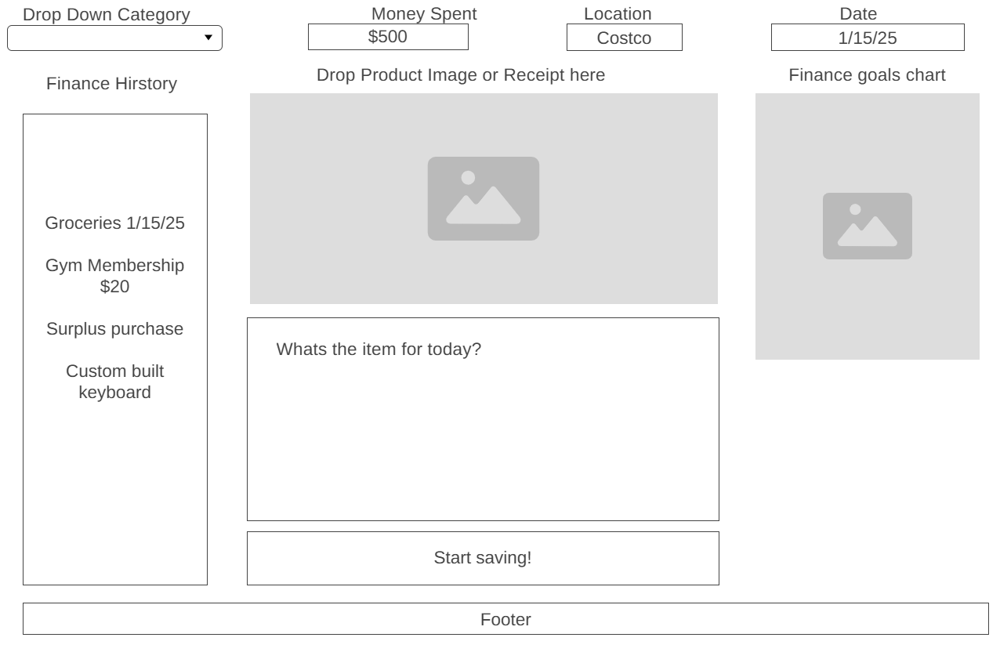

# SpendWiser Finance Tracker
## Problem Statement
- Limit spending habits
- Budget in a more controlled and easier enviorment
- View totals spent in an entire day/week
## Target Users
- Users who want to keep track of their finances
- Students managing limited budgets
- Young professionals who want to track their expenses and savings
- Freelancers with uncommon income
- Anyone who wants a simple simple finance tracking
## MVP
- Category functionality, (Food, Rent, Hobbies, Transport, etc)
- Input boxes for Date, Money spent, Description
- Image box for uploading images of the item~
## Extended Features
- Total spent
- Remaining balanace
- Transaction History (list view)
- Monthly summary dashboard
- pie chart for categories
## Core Entities
- Integers
- Strings
- Images
## Key Relationships
- Integers will be Dates, amount of money spent
- Strings will store the Description
- Images will be stored for easier identification
## User Flows
- Users can accomplish key tasks by keeping track and monitoring their spending.
## Wireframe

# Docker Deployment
- Have docker installed & running
- Run `docker compose up -d --build` at the root of the project
- Docker will take over and build the two dockerfiles located in the frontend & backend
- Frontend Port: `localhost:5173`
- Backend Port: `localhost:3001` - `/api/health` - `/expenses`

# MVP for Sprint 2 Deliverable (Xavier & Jacob)

- Add ability to upload images
    - may need to update table for db
    - may need to find additional libaries for adding 

- Add description on side bar within finance history
    - may need to manipulate css
    - may need to add logic for appending data to div

# MVP for Sprint 3 Deliverable (Tim & Jesse)

- **Add more Category selections**: We can add stuff like *Car-Parts*, *Groceries*, *Computer-Hardware*, *Gaming-Mouses*, etc. 
    - Update React backend and frontend to have different selections

- **Fix up Finance History**: It looks good they added the Description, but it could still use more work. I wouldn't want a Client seeing this.
    - Make the added history easier to read
    - Make images be closer to the size they are
    - Fix timeslot

- **General CSS Work**: Wireframe is great, but lets start moving towards production and pretend as if this was going to be seen by a client. 
    - Start to make the app fill the entire page, everything is kind of just shoved on there right now
    - Center divs, enlarge buttons, fix overall format

- **Use python pandas for Finance Goals?**: SDEV494 is currently teaching us Pandas, why not try and further that knowledge and use it on a real application.
    - Use the df.plot(kind = "bar") or df.plot(kind = "scatter") possibly for adding a graph within the SPA

# MVP for Sprint 4 Deliverable (Xavier & Jacob)
- **Delete button - Finace History**: We are able to add to our finace history but we would like the ability to delete or remove them.
    - Add functionality to remove past purchases from finance history
    - Need logic for a button that can add and delete a category
    - Need logic for removing from the Database (100% remove from Database)
- **Add Category Button**: We want logic for adding specfic categories to our finace history, we only have hard coded values now and would like for users to be specifc.
    - Add functionality to add new categories to the category drop down
    - Button near or on the dropdown for the categories
- **Fix timestamp**: Right now our timestamp is *2026-02-19T00:00:00.000Z* this is kind of unhuman to read.
    - Format times to be easier to read when they are added to the finace history
- **Look into Finance Chart**
    - Look into creating a pie chart that counts the spending for a product

# Testing Requirements for Spendwiser
- **FE tests**: Verify users are able to view and interact with the SPA
    - Use **vitest** for testing
    - Ensure SPA renders to the user
    - Verify users are able to enter into the input boxes
- **BE tests**: Verify the **/expenses** route correctly returns stored expenses and accepts new expense submissions
    - Use **Jest** or **supertest** for testing
    - Ensure **/expenses** correctly sends expense data
    - Ensure **/expenses** returns stored expense data
    - Ensure **/expenses** accepts new expense data
- **Integration tests**: Verify that the **/expenses** API correctly interacts with the database.
    - Use **Jest** or **supertest** for testing
    - Verify the **/expenses** API correctly stores data
    - Verify the **/expenses** API correclty retrieves data
- **E2E tests**: Verify full functionality of the SPA
    - Use **playwright** or **cypress** for testing
    - Verify users can submit data/expenses through the UI
    - Verify data appears on UI